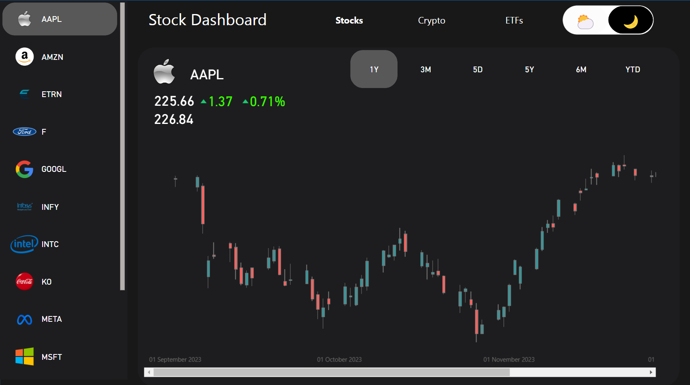
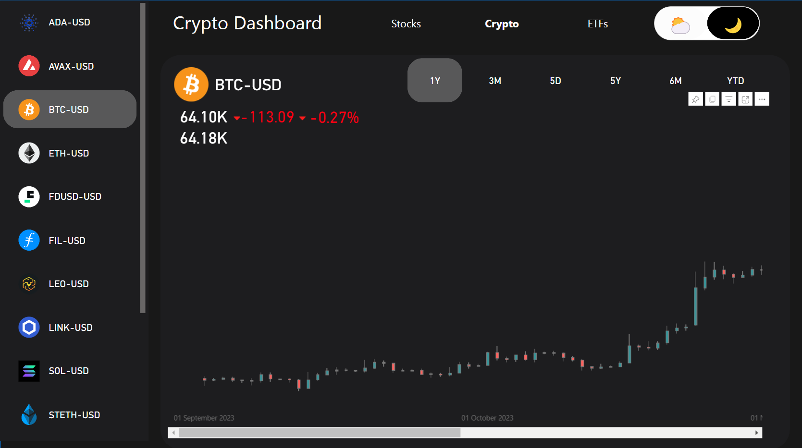
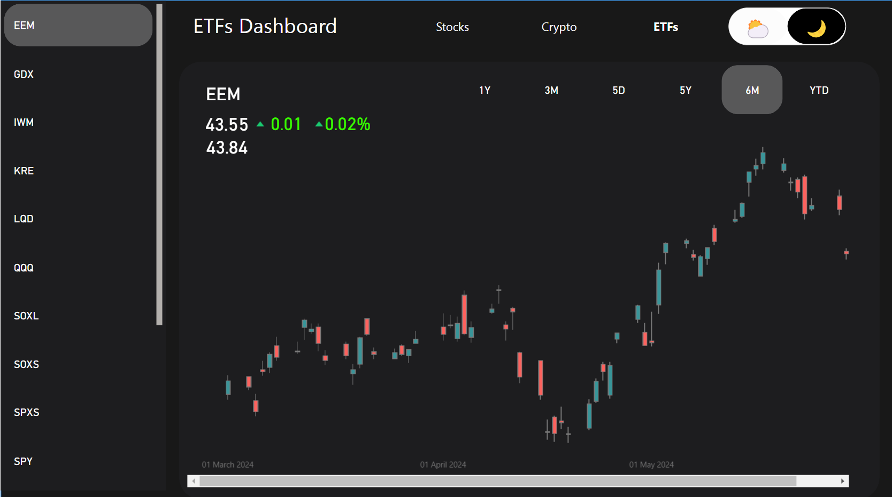
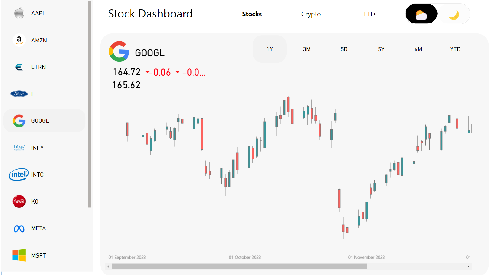
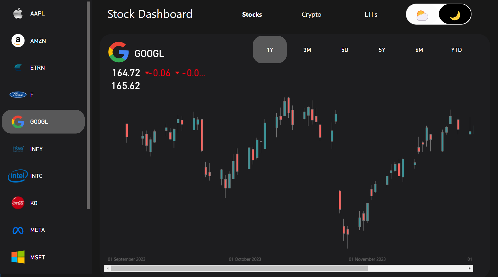

# Market Dashboard - PowerBI Project

## 📊 Overview

This Power BI dashboard provides a comprehensive view of stocks, cryptocurrencies, and ETFs, offering users a visually appealing and highly functional tool for financial analysis. The dashboard supports both light and dark modes, catering to different aesthetic preferences. It includes a dynamic graph that displays historical data, scraped using a custom Python script from Yahoo Finance, ensuring accurate and up-to-date information.

## 🌟 Features

- **Light & Dark Mode:** Aesthetic flexibility with a toggle between light and dark themes.
- **Comprehensive Market Analysis:** 
  - **Stocks Dashboard:** Detailed stock information, including real-time data and historical trends.
  - **Crypto Dashboard:** Insights into the top cryptocurrencies, including price changes and market caps.
  - **ETFs Dashboard:** A complete overview of major ETFs, their performances, and historical data.
- **Historical Data Visualization:** Graphical representation of historical data, enabling in-depth trend analysis.
- **Advanced DAX Expressions:** Custom columns and measures created using advanced DAX expressions to enhance data analysis and reporting.

## 🛠️ Tools & Technologies

- **PowerBI:** Used for creating the dashboard, visualizations, and handling data.
- **Python:** Utilized for scraping historical financial data from Yahoo Finance.
- **Yahoo Finance:** Source of all historical data for stocks, cryptocurrencies, and ETFs.
- **DAX:** Used for creating custom columns and advanced calculations.

## 📷 Screenshots

### Stock, Crypto, and ETFs Dashboards
<p align="center">
  
  
  
</p>

### Light & Dark Modes
<p align="center">
  
  
</p>

## 🚀 Getting Started

1. **Clone the repository:**
   ```bash
   git clone https://github.com/RaghavArora2/Market-Dashboard-Project-in-Power-BI.git
   ```

2. **Open the Power BI File:** Open the `.pbix` file in Power BI Desktop.

3. **Run the Python Script:** Execute the Python script to scrape the latest historical data from Yahoo Finance.

4. **Update the Data Source:** Load the updated data into the Power BI dashboard.

## 📈 Future Improvements

- **Real-time Data Integration:** Integrate APIs to fetch real-time data for stocks, cryptocurrencies, and ETFs.
- **User Customization:** Allow users to select specific stocks, cryptocurrencies, or ETFs to monitor.
- **Mobile Optimization:** Enhance the dashboard for better viewing and interaction on mobile devices.

## 🤝 Contributing

If you'd like to contribute to this project, please fork the repository and create a pull request with your proposed changes.

## 📜 License

This project is licensed under the MIT License - see the [LICENSE](LICENSE) file for details.

## 📬 Contact

For any inquiries, please reach out to me on [LinkedIn](https://www.linkedin.com/in/raghav-arora2003/).
